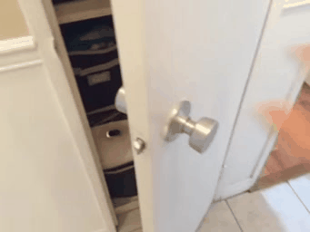
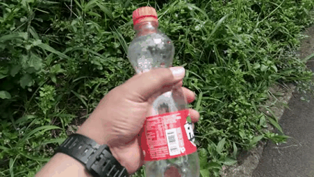

# C2C: Component-to-Composition Learning for Zero-Shot Compositional Action Recognition
### [Project Page](https://github.com/RongchangLi/ZSCAR_C2C) | [Paper](https://arxiv.org/abs/2407.06113)
<br/>

> C2C: Component-to-Composition Learning for Zero-Shot Compositional Action Recognition

> [Rongchang Li](https://rongchangli.github.io/), Zhenhua Feng, Tianyang Xu, Linze Li, Xiaojun Wu†, Muhammad Awais, Sara Atito, Josef Kittler           
> ECCV, 2024
                                                                 
[//]: # (&#40;For displaying sample GIFs&#41;)
<div align="center">
  <table style="border-collapse: collapse;">
    <tr>
      <td style="text-align: center; padding: 10px;">
        
        <br />
        <i>
          <font color="black"><strong>Seen:</strong></font> 
          <font color="red">Open</font> 
          <font color="blue">a door</font>
        </i>
      </td>
      <td style="text-align: center; padding: 10px;">
        
        <br />
        <i>
          <font color="black"><strong>Seen:</strong></font> 
          <font color="red">Close</font> 
          <font color="blue">a book</font>
        </i>
      </td>
      <td style="height: 120px; width: 1px; border-left: 2px dashed gray; text-align: center; padding: 10px;"></td>
      <td style="text-align: center; padding: 10px;">
        
        <br />
        <i>
          <font color="black"><strong>Unseen:</strong></font> 
          <font color="red">Close</font> 
          <font color="blue">a door</font>
        </i>
      </td>
    </tr>
  </table>
  <div style="margin-top: 1px;">
    <strong>Zero-Shot Compositional Action recognition (ZS-CAR)</strong>
  </div>
</div>


## 🛠️ Prepare Something-composition (Sth-com)
<p align="middle" style="margin-bottom: 0.5px;">
   
   
   
  
   
</p>
<p align="middle" style="margin-bottom: 0.5px;margin-top: 0.5px;">
  
   
   
  
  
</p>
<p align="center" style="margin-top: 0.5px;">
  <strong>Some samples in Something-composition</strong>
</p>

1. **Download Something-Something V2 (Sth-v2)**. Our proposed Something-composition (Sth-com) is based on [Sth-V2](https://developer.qualcomm.com/software/ai-datasets/something-something).
We refer to the official website to download the videos to the path _video_path_.
2. **Extract frames**. To accelerate the dataloader when training, we extract the frames for each video and save them in the _frame_path_. The command is:
      ```bash
      python tools/extract_frames.py --video_root video_path --frame_root frame_path
      ```
3. **Download Dataset annotations**. We provide our Sth-com annotation files in the [data_split](data_split/generalized) dir. The format is like:
    ```bash
      [
          {
          "id": "54463", # means the sample name
          "action": "opening a book", # means composition
          "verb": "Opening [something]", # means the verb component
          "object": "book" # means the object component
          },
          {
            ...
          },
          {
            ...
          },
      ]
    ```
    Please kindly download these files to _annotation_path_.
4. **Finally**, the dataset is built successfully. The structure looks like:
      >   * annotation_path
      >     * data_split
      >       * generalized
      >         * train_pairs.json
      >         * val_pairs.json
      >         * test_pairs.json
      >   * frame_path
      >     * 0
      >         * 000001.jpg
      >         * 000002.jpg
      >         * ......
      >     * 1
      >         * 000001.jpg
      >         * 000002.jpg
      >         * ......
      >     * ......


## 📝 TODO List
- [ ] Add training codes.
